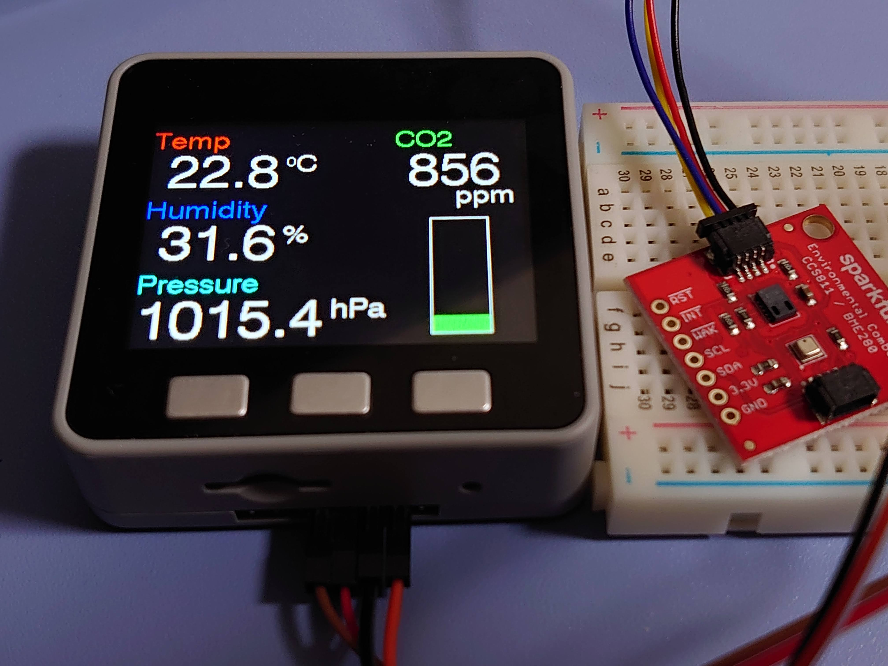
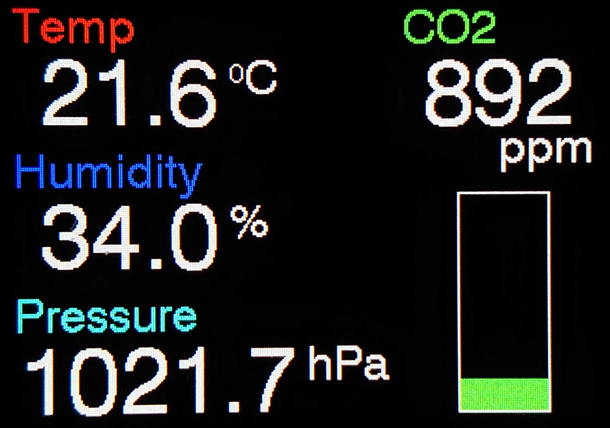
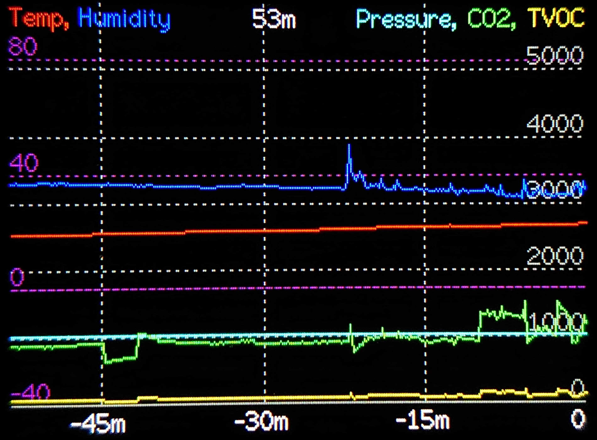
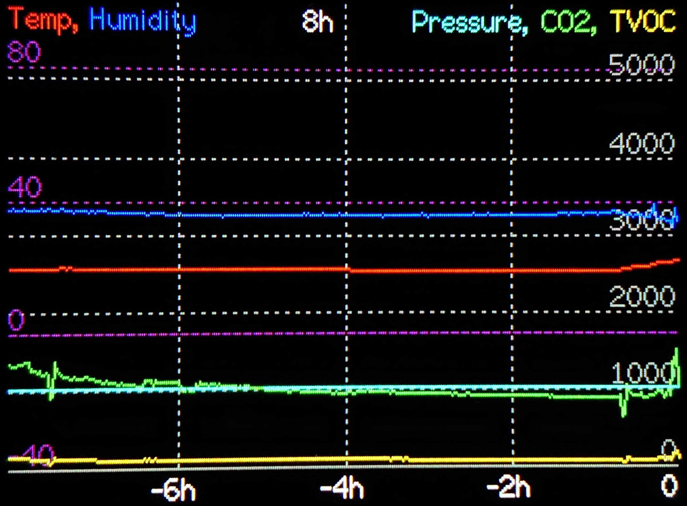
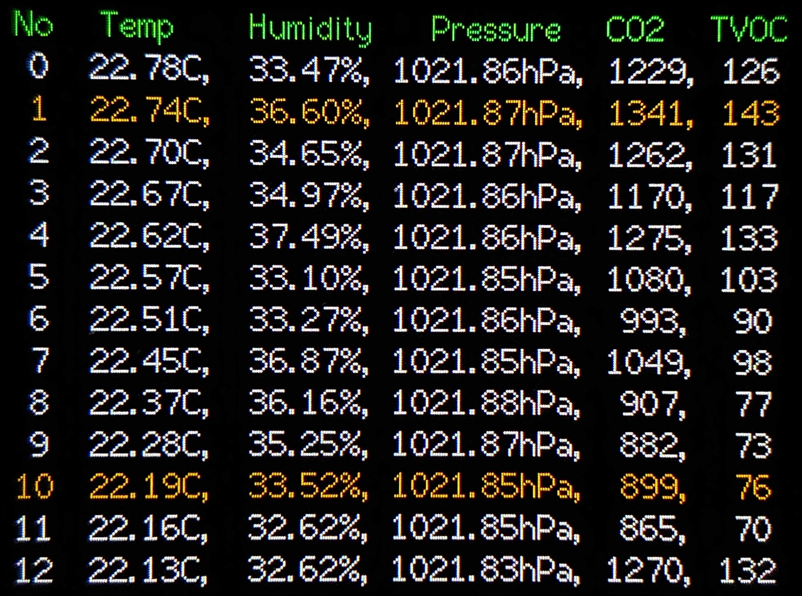

# AirMonitor
Air Quality monitor for M5Stack 
本ページに記載された内容、および プログラムコードは無保証です。

## 概要/Overview
 
M5Stackを使って、空気環境を測定するデバイスを作りました。 
在宅や職場などで、スタンドアローンで空気環境をチェックしたいときにどうぞ。 
新型コロナ対策で、換気の必要度を判断する際にも有効だと思います。

CCS811,BME280という２つのセンサーを使って下記の５項目を測定し、M5Stackの画面に表示します。 
  ||単位|測定範囲|
  |:---:|:---:|:---:|
  |温度/Temperature|℃, 摂氏|-40℃ to +85℃|
  |湿度/Humidity|%|0% to 100%|
  |気圧/Pressure|hPa, ヘクトパスカル|300hPa to 1100hPa|
  |二酸化炭素相当物/eCO2|ppm|400ppm to 8192ppm|
  |総揮発性有機化合物/TVOC|ppb|0ppb to 1187ppb|
  
  ※測定範囲は、センサーの仕様に基づく
* 測定値はM5Stackの液晶画面に、グラフ形式など３つのモードで表示します 
  表示モードは、前面ボタンでいつでも自由に切り替えることが出来ます。
* CO2測定値が高い場合は、通知画面を表示し換気を促します
* wifiネットワークは不要であり、電源を繋いでおけば動作します

## パーツリスト/Parts list
* M5Stack Basic/GRAY 
  私はGRAYを使いましたが、Basicでもいけるはず。。未確認
* SparkFun Environmental Combo Breakout - CCS811/BME280 (Qwiic) 
  https://www.sparkfun.com/products/14348 
* センサーとM5Stackを接続するためのブレッドボードなど 
* 適当なUSB Type-C電源 
  M5Stackへの電源供給用。 

※試したところ、「[Qwiic Cable - Grove Adapter (100mm)](https://www.sparkfun.com/products/15109)」のケーブルは使えませんでした。。 
  M5StackのGroveコネクタの出力は5Vだけど、このセンサーは3.3Vを要求しているので。

## 組み立て方/How to build
1. Arduino IDEをセットアップ 
  Arduino IDEをインストールしてM5Stackとの通信COMポートを設定した後、必要なライブラリをインストールします。
   - M5Stack by M5Stack 
     https://github.com/m5stack/m5stack
   - SparkFun BME280 Arduino Library by SparkFun Electronics 
     https://github.com/sparkfun/SparkFun_BME280_Arduino_Library
   - SparkFun CCS811 Arduino Library by SparkFun Electronics 
     https://github.com/sparkfun/SparkFun_CCS811_Arduino_Library
2. ハードウェアの接続 
   1. M5Stackとセンサーを接続 
     M5StackのI2CピンとセンサーのQwiicコネクタを、ブレッドボードなどで繋ぎます。 
     センサーボードにはQwiicコネクタが２つありますが、どちらでも良いみたい。 
     |M5Stack側|センサー側|
     |:---:|:---:|
     |GND|Black|
     |3.3V|Red|
     |SDA|Blue|
     |Yellow|SCL|
   2. Arduino IDEをインストールしたパソコンのUSBポートに、M5Stackを接続
3. スケッチのダウンロード 
  本ページからairMon.ino、envList.hをダウンロードした後、"airMon"という名前のフォルダに入れます。
4. スケッチのコンパイルと、M5Stackへの書き込み 
  airMon.inoをダブルクリックしてArduino IDEにて開いた後、「マイコンボードに書き込む」を実行。  
  
## 使い方/How to use
### 電源オン、オフ
* M5StackにUSB電源を接続するか電源ボタンを押すと、電源が入ります。 
  「Wait...」と30秒ほど表示されたあと、現在値モニタ画面が表示されます。
* M5StackからUSB電源を外すと、電源が切れます。
* USB電源が外れている場合は、電源ボタンを2回押すと電源が切れます。
* USBにて電源が供給されている時に電源を切ることは出来ません。
  
### 表示モード切り替え
前面ボタンを押すと、表示モードが切り替わります。
* 左ボタン： 現在値モニタモード
* 中央ボタン： グラフモード
* 右ボタン： データモード

何もボタンを押さずに３分経過すると省電力モードになり、バックライトが消えます。
  
#### 現在値モニタモード 
 
最も最近に測定した値が表示されます。 
右側の棒グラフはCO2レベルを表わしたもので、下記のように色が変化します。 
基準は、日本産業衛生学会様のホームページを参考にしました。 
http://jsoh-ohe.umin.jp/covid_simulator/covid_simulator.html 
|CO2値|表示色|換気状態|
|:---:|:---:|:---:|
|0ppm ～ 1000ppm|緑|良い|
|1000ppm ～ 1500ppm|黄色|やや良い|
|1500ppm ～ 2500ppm|オレンジ|悪い|
|2500ppm ～ 3500ppm|ピンク|非常に悪い|
|3500ppm ～ 6000ppm|赤|極めて悪い|
|6000ppm ～|棒グラフ全体が赤くなります|〃|

#### グラフモード 
  53分グラフ 
   
  8時間グラフ 
   
  過去の測定値を折れ線グラフで表示します。 
  中央ボタンを続けて押すと、表示幅が53分/8時間で切り替わります。 
  右端が最も最近の測定値であり、左に行くほど古い測定値です。 
  - 上端 
    各測定値ごとの色見本を表示します。 
    左に寄っている測定値は左のY軸目盛りで、右に寄っている測定値は右のY軸目盛りで表示します。 
    真ん中に、時間幅(53m/8h)を表示します。 
  - 右端、左端 
    Y軸目盛りを表示します。 
    表示範囲： 
    - 左端(温度、湿度): -40 ～ 100
    - 右端(気圧、CO2、TVOC): 0 ～ 3000 または 0 ～ 6000 
      ※グラフ表示範囲のCO2最大値により変化します
  - 下端 
    時間目盛りを表示します。 
    右端(0)が最新で、過去の目盛りはマイナス記号で表示します。 
    "-15m"は15分前、"-2h"は2時間前。
  
#### データモード 
   
  最近の測定値を13回分、一覧表示します。 
  オレンジ色のデータは、8時間幅でグラフを表示した時に選択される値です。 
  一番上(No=0)が最も最近に測定した値であり、下に行くほど古い測定値です。 

### CO2通知
  省電力モード中で画面が消えている時に高いCO2値を検知すると、画面が点滅します。
  - １分おきに測定値をチェックしており、高いCO2値を検知すると画面が３秒間点灯します。
  - 点灯する色は、現在値モニタモードのCO2棒グラフと同じ色です。
  - 既定値では、CO2値が1500ppmを超えると画面が点滅します。
  - co2LvList構造体を修正することで、CO2レベルごとの通知内容(通知なし/画面点滅/画面点滅+音)を変更できます。

### その他
  * 空気環境の測定は、10秒毎に行っています。 
    設定により1秒毎に測定することも出来ますが、センサーの寿命に影響するので10秒毎での測定を推奨します。

## 技術的なこと/Technical notes
- データ領域は循環して使用するので、リング型のバッファとしています。
- バッファサイズは3006個であり、10秒毎に測定するので10秒x3006回で8.35時間分の測定値を内部メモリーに保存しています。
- 測定値を漏れなく記録するため、測定値を記録する処理と画面を表示する処理は別スレッドに分けています。
- CCS811とBME280が別になったボードをデイジーチェーン接続しても、動作するかもしれないです。 
  その場合は、I2Cアドレス(CSS811_ADDR)の定義を変更すると良いかも。
  
## 参考資料/References
 - BME280センサー仕様 
  https://www.bosch-sensortec.com/products/environmental-sensors/humidity-sensors-bme280/
 - CCS811センサー仕様 
  https://cdn.sparkfun.com/assets/learn_tutorials/1/4/3/CCS811_Datasheet-DS000459.pdf
 - 神楽坂らせんちゃんさんのgithub 
   色々参考にさせていただいてます^^; 
   https://github.com/kagurazakarasen
