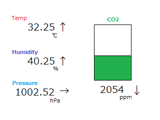

# AirMonitor
Air Quality monitor for M5Stack 
本ページに記載された内容、および プログラムコードは無保証です。

## 概要/Overview
 
M5Stackを使って、空気環境を測定するデバイスを作りました。 
CCS811,BME280という２つのセンサーを使って下記の５項目を測定し、M5Stackの画面に表示します。 
  ||単位|測定範囲|
  |:---:|:---:|:---:|
  |温度/Temperature|℃, 摂氏|-40℃ to +85℃|
  |湿度/Humidity|%|0% to 100%|
  |気圧/Pressure|hPa, ヘクトパスカル|300hPa to 1100hPa|
  |二酸化炭素相当物/eCO2|ppm|400ppm to 8192ppm|
  |総揮発性有機化合物/TVOC|ppb|0ppb to 1187ppb|
  
※測定範囲は、センサーの仕様に基づく
  
測定値はM5Stackの液晶画面に表示され、下記３つの表示モードがあります。
- 現在値モニタ 
  現在の測定値を表示。
- グラフ 
  過去のデータをグラフ表示。
- データ 
  最近の測定値を一覧表示。
  
wifiネットワークは不要で、電源を繋いでおけば動作します。 
在宅や職場などで、スタンドアローンで空気環境をチェックしたいときにどうぞ。

## パーツリスト/Parts list
* M5Stack Basic/GRAY 
  私はGRAYを使いましたが、Basicでもいけるはず。。未確認
* SparkFun Environmental Combo Breakout - CCS811/BME280 (Qwiic) 
  https://www.sparkfun.com/products/14348
* Qwiic Cable - Grove Adapter (100mm) 
  https://www.sparkfun.com/products/15109 
  私はブレッドボードを使いましたが、このケーブルでいけるはず。。未確認
* 適当なUSB Type-C電源 
  M5Stackへの電源供給用。
  
## 組み立て方/How to build
1. Arduino IDEをセットアップ 
  Arduino IDEをインストールしてM5Stackとの通信COMポートを設定した後、必要なライブラリをインストールします。
   - M5Stack by M5Stack 
     https://github.com/m5stack/m5stack
   - SparkFun BME280 Arduino Library by SparkFun Electronics 
     https://github.com/sparkfun/SparkFun_BME280_Arduino_Library
   - SparkFun CCS811 Arduino Library by SparkFun Electronics 
     https://github.com/sparkfun/SparkFun_CCS811_Arduino_Library
2. スケッチのダウンロード 
  本ページからairMon.ino、envList.hをダウンロードした後、"airMon"という名前のフォルダに入れます。
3. ハードウェアの接続 
   - M5Stackとセンサーを、Qwiic Cableにて接続
   - Arduino IDEをインストールしたパソコンのUSBポートに、M5Stackを接続
4. スケッチのコンパイルと、M5Stackへの書き込み 
  airMon.inoをダブルクリックしてArduino IDEにて開いた後、「マイコンボードに書き込む」を実行。
  
## 使い方/How to use
### 電源オン、オフ
* M5StackにUSB電源を接続するか電源ボタンを押すと、電源が入ります。 
  「Wait...」と数秒表示されたあと、現在値モニタ画面が表示されます。
* M5StackからUSB電源を外した後に、電源ボタンを２回続けて押すと電源が切れます。 
  USBにて電源が供給されている時に電源を切ることは出来ません。
### 表示モード切り替え
  前面ボタンを押すと、表示モードが切り替わります。
  - 左ボタン： 現在値モニタモード
  - 中央ボタン： グラフモード
  - 右ボタン： データモード
#### 現在値モニタモード 
  最も最近に測定した値が表示されます。 
  右側の棒グラフはCO2レベルを表わしたもので、下記のように色が変化します。 
  基準は、日本産業衛生学会様のホームページを参考にしました。 
  http://jsoh-ohe.umin.jp/covid_simulator/covid_simulator.html
  - ～1000ppm: 緑 - 良い
  - ～1500ppm: 黄色 - やや良い
  - ～2500ppm: オレンジ - 悪い
  - ～3500ppm: ピンク - 非常に悪い
  - ～6000ppm: 赤 - 極めて悪い
  - 6000ppm～: 棒グラフ全体が赤くなります
#### グラフモード 
  過去の測定値を折れ線グラフで表示します。 
  右端が最も最近の測定値であり、左に行くほど古い測定値になります。 
  連続して押すと、表示幅が53分/8時間で切り替わります。
#### データモード 
  直前13回分の測定値を一覧表示します。 
  オレンジ色のデータは、8時間幅でグラフを表示した時に選択される値です。 
  一番上(No=0)が最も最近に測定した値であり、下に行くほど古い測定値になります
### その他
  * 何もボタンを押さずに３分経過すると省電力モードになり、バックライトも消灯します。
  * 空気環境の測定は、10秒毎に行っています。

## 技術的なこと/Technical notes
- データ領域は循環して使用するので、リング型のバッファとしています。
- バッファサイズは3006個であり、10秒毎に測定するので10秒x3006回で8.35時間分の測定値を内部メモリーに保存しています。
- 測定値を漏れなく記録するため、測定値を記録する処理と画面を表示する処理は別スレッドに分けています。
- スレッド間で競合する部分は、排他処理としています。
- CCS811とBME280が別になったボードをデイジーチェーン接続しても動作するかもしれない。 
  その場合は、I2Cアドレス(CSS811_ADDR)の定義を変更すると良いかも。
  
## 参考資料
 - BME280センサー仕様 
  https://www.bosch-sensortec.com/products/environmental-sensors/humidity-sensors-bme280/
 - CCS811センサー仕様 
  https://cdn.sparkfun.com/assets/learn_tutorials/1/4/3/CCS811_Datasheet-DS000459.pdf
 - 神楽坂らせんちゃんさんのgithub 
   色々参考にさせていただいてます^^; 
   https://github.com/kagurazakarasen
